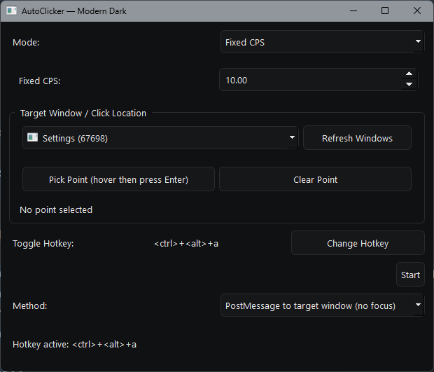
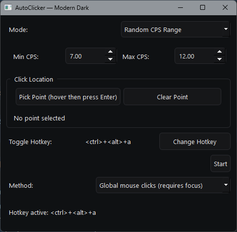

# AutoClicker

<div align="center">
  

  A modern, easy-to-use auto clicker with human-like clicking patterns and advanced targeting options.

  ⚠️ **Vibe Coded Application** - This project was developed with vibes and AI. If you find any bugs or issues, please [open an issue](https://github.com/toomcis/autoclicker/issues) so we can fix them together!

</div>

## Features

✨ **Multiple Clicking Modes**

- Fixed CPS (Clicks Per Second) mode for consistent clicking
- Random CPS range for human-like, variable clicking patterns

🎯 **Flexible Targeting**

- PostMessage targeting for non-focused window clicking (no window focus required)
- Global mouse click mode for anywhere on screen
- Point picking with live preview
- Automatic fallback to cursor position

⌨️ **Custom Hotkeys**

- Capture any key combination (including multi-key bindings like Ctrl+Shift+A+B)
- Global hotkey support with real-time callback
- Easy hotkey editing via intuitive dialog

🎨 **Modern UI**

- Dark theme with Segoe UI font
- Dynamically responsive layout
- Adaptive window sizing based on visible controls

## Installation

### Quick Start (Precompiled)

Download the latest `.exe` from [Releases](https://github.com/toomcis/autoclicker/releases) and run it directly. No installation required!

### From Source

#### Prerequisites

- Python 3.8+
- pip

#### Steps

1. Clone the repository:

   ```bash
   git clone https://github.com/toomcis/autoclicker.git
   cd autoclicker
   ```
2. Install dependencies:

   ```bash
   pip install -r requirements.txt
   ```
3. Run the application:

   ```bash
   python autoclicker.py
   ```

## Usage

### Basic Setup

1. **Select Mode**: Choose between "Fixed CPS" or "Random CPS Range"
2. **Choose Method**: Pick "PostMessage" (no focus) or "Global clicks" (requires focus)
3. **Set Target** (optional): Click "Pick Point" to select where to click
4. **Configure Hotkey**: Click "Change Hotkey" to set your toggle key
5. **Click Start** or press your hotkey to begin

### Modes

**Fixed CPS**

- Clicks at a constant rate (e.g., 10 clicks/second)
- Great for applications requiring consistent timing

**Random CPS Range**

- Clicks between min and max CPS values
- More human-like and less detectable
- Example: 7-12 CPS creates natural variation

### Click Methods

**PostMessage (No Focus Required)**

1. Select a target window from the dropdown
2. Click "Pick Point"
3. Move cursor to desired location in the window
4. Press ENTER to confirm
5. The clicker will send clicks directly to the window without requiring focus

**Global Mouse Clicks**

1. Optionally pick a screen point (or it will click at cursor location)
2. Requires the window to be in focus when clicks are sent

### Customizing Hotkeys

Click "Change Hotkey" to open the capture dialog:

1. Press your desired key combination (e.g., Ctrl+Shift+A)
2. Optionally add more keys (e.g., press B to make it Ctrl+Shift+A+B)
3. Click "Apply" to save

## Screenshots

### Main Interface



### Settings & Configuration



### CPS Tester Showcase


## Development

### Project Structure

```
autoclicker/
├── autoclicker.py          # Main application
├── autoclicker.ico         # Window icon
├── autoclicker.png         # Logo
├── requirements.txt        # Dependencies
├── screenshot1.png         # UI screenshot
├── screenshot2.png         # Settings screenshot
├── showcase.gif            # CPS tester demo
└── README.md              # This file
```

### Setting Up Development Environment

1. Clone and install:

   ```bash
   git clone https://github.com/toomcis/autoclicker.git
   cd autoclicker
   pip install -r requirements.txt
   ```
2. Run the app:

   ```bash
   python autoclicker.py
   ```
3. Make your changes and test locally

### Key Components

- **HotkeyCaptureDialog**: Captures key combinations via Qt events
- **AutoClicker**: Main window class managing UI and clicking logic
- **click_loop()**: Background thread handling the actual clicking

### Architecture

- Threading for non-blocking hotkey listening and clicking
- Qt signals/slots for thread-safe GUI updates
- Win32 APIs for PostMessage targeting and window enumeration

## Building an Executable

Convert the Python script into a standalone `.exe` using PyInstaller:

```bash
pip install pyinstaller
pyinstaller --onefile -w --icon=autoclicker.ico autoclicker.py
```

The compiled executable will be in the `dist/` folder:

```
dist/
└── autoclicker.exe        # Standalone executable (~100MB)
```

### Build Options

- `--onefile` — Single executable instead of folder
- `-w` / `--windowed` — Hide console window
- `--icon=autoclicker.ico` — Embed application icon

### Distribution

Simply distribute the `.exe` file. Users don't need Python or any dependencies installed!

## Dependencies

- **PyQt5** — Modern GUI framework
- **pywin32** — Windows API access (PostMessage, window enumeration)
- **pynput** — Global hotkey and mouse control

See [requirements.txt](requirements.txt) for exact versions.

## Reporting Issues

Found a bug? 🐛 Please help us improve!

1. Check if the issue already exists: [Issues](https://github.com/toomcis/autoclicker/issues)
2. If not, [create a new issue](https://github.com/toomcis/autoclicker/issues/new) with:
   - Clear description of the problem
   - Steps to reproduce
   - Expected vs actual behavior
   - OS and Python version (if running from source)

## License

This project is provided as-is. Feel free to use, modify, and distribute!

## Contributing

Pull requests welcome! Feel free to fork and contribute improvements.

---

**Made with ❤️ and vibes** — Enjoy your AutoClicker!
